# Spring Security请求全过程解析

Spring Security是一款基于Spring的安全框架，主要包含认证和授权两大安全模块，和另外一款流行的安全框架Apache Shiro相比，它拥有更为强大的功能。Spring Security也可以轻松的自定义扩展以满足各种需求，并且对常见的Web安全攻击提供了防护支持。如果你的Web框架选择的是Spring，那么在安全方面Spring Security会是一个不错的选择。

这里我们使用Spring Boot来集成Spring Security，Spring Boot版本为***2.5.3***，Spring Security版本为***5.5.1***。

## 开启Spring Security

使用IDEA创建一个Spring Boot项目，然后引入***spring-boot-starter-security***：

```java
dependencies {
    implementation 'org.springframework.boot:spring-boot-starter-security'
    implementation 'org.springframework.boot:spring-boot-starter-web'
    implementation 'org.projectlombok:lombok:1.18.8'
    annotationProcessor 'org.projectlombok:lombok:1.18.8'
    providedRuntime 'org.springframework.boot:spring-boot-starter-tomcat'
    testImplementation 'org.springframework.boot:spring-boot-starter-test'
    testImplementation 'org.springframework.security:spring-security-test'
}
```

接下来我们创建一个***HelloController***，对外提供一个<strong><i>/hello</i></strong>服务：

```java
@RestController
public class HelloController {
    @GetMapping("hello")
    public String hello() {
        return "hello world";
    }
}
```

这时候我们直接启动项目，访问<strong><i>http://localhost:8080/hello</i></strong>，可以看到页面跳转到一个登陆页面：

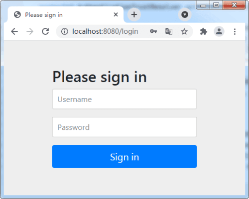

默认的用户名为user，密码由Sping Security自动生成，回到IDEA的控制台，可以找到密码信息：

```java
Using generated security password: 4f06ba04-37e9-4bdd-a085-3305260da0d6
```

输入用户名user，密码4f06ba04-37e9-4bdd-a085-3305260da0d6后，我们便可以成功访问<strong><i>/hello</i></strong>接口。

## 基本原理

Spring Security默认为我们开启了一个简单的安全配置，下面让我们来了解其原理。

当Spring Boot项目配置了Spring Security后，Spring Security的整个加载过程如下图所示：

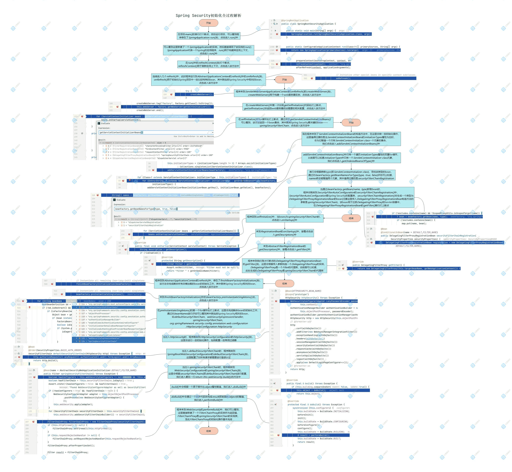

而当我们访问<strong><i>http://localhost:8080/hello</i></strong>时，代码的整个执行过程如下图所示：

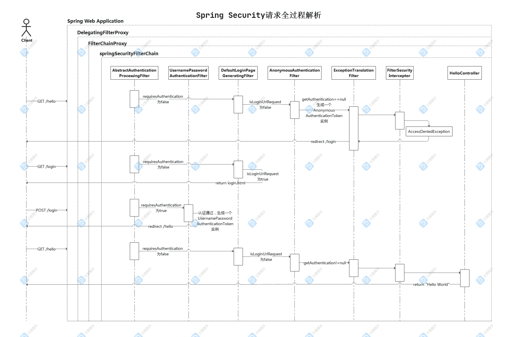

如上图所示，Spring Security包含了众多的过滤器，这些过滤器形成了一条链，所有请求都必须通过这些过滤器后才能成功访问到资源。

下面我们通过debug来验证这个过程：

首先，通过前面可以知道，当有请求来到时，最先由***DelegatingFilterProxy***负责接收，因此在***DelegatingFilterProxy***的<strong><i>doFilter()</i></strong>的首行打上断点：

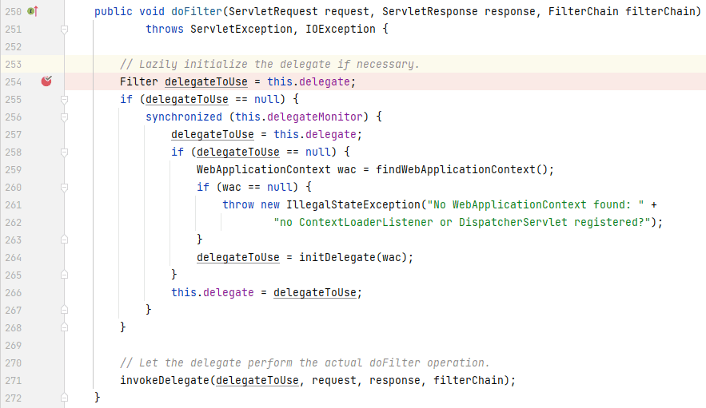

接着***DelegatingFilterProxy***会将请求委派给***FilterChainProxy***进行处理，在***FilterChainProxy***的首行打上断点：


***FilterChainProxy***会在<strong><i>doFilterInternal()</i></strong>中生成一个内部类***VirtualFilterChain***的实例，以此来调用Spring Security的整条过滤器链，在***VirtualFilterChain***的<strong><i>doFilter()</i></strong>首行打上断点：

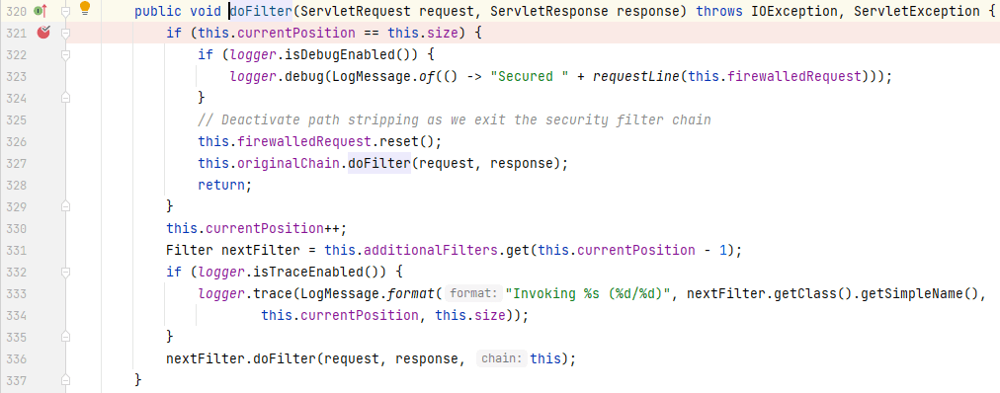

接下来***VirtualFilterChain***会通过***currentPosition***依次调用存在***additionalFilters***中的过滤器，其中比较重要的几个过滤器有：***UsernamePasswordAuthenticationFilter***、***DefaultLoginPageGeneratingFilter***、***AnonymousAuthenticationFilter***、***ExceptionTranslationFilter***、***FilterSecurityInterceptor***，我们依次在这些过滤器的<strong><i>doFilter()</i></strong>的首行打上断点：

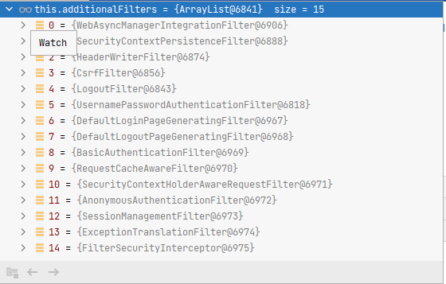

准备完毕后，我们启动项目，然后访问<strong><i>http://localhost:8080/hello</i></strong>，程序首先跳转到***DelegatingFilterProxy***的断点上：

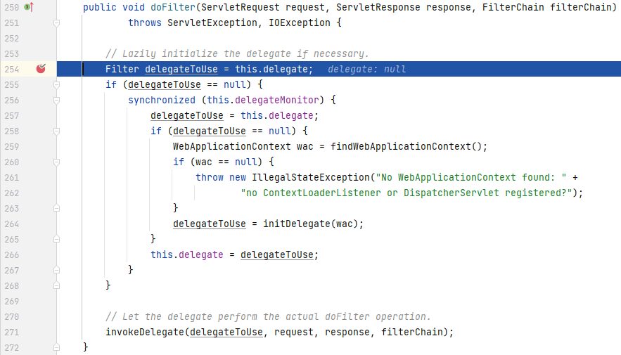

此时***delegate***还是null的，接下来依次执行代码，可以看到***delegate***最终被赋值一个***FilterChainProxy***的实例：

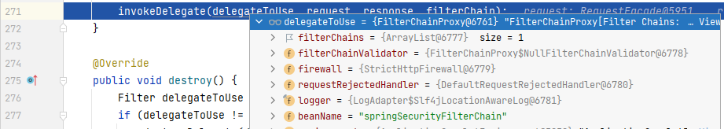

接下来程序依次跳转到***FilterChainProxy***的<strong><i>doFilter()</i></strong>和***VirtualFilterChain***的<strong><i>doFilter()</i></strong>中：

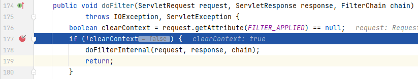

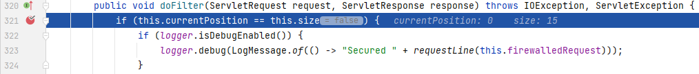

接着程序跳转到***AbstractAuthenticationProcessingFilter***（***UsernamePasswordAuthenticationFilter***的父类）的<strong><i>doFilter()</i></strong>中，通过<strong><i>requiresAuthentication()</i></strong>判定为false（是否是POST请求）：

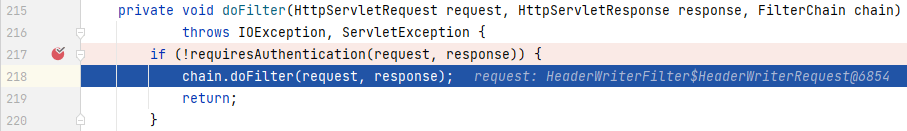

接着程序跳转到***DefaultLoginPageGeneratingFilter***的<strong><i>doFilter()</i></strong>中，通过<strong><i>isLoginUrlRequest()</i></strong>判定为false（请求路径是否是<strong><i>/login</i></strong>）：


接着程序跳转到***AnonymousAuthenticationFilter***的<strong><i>doFilter()</i></strong>中，由于是首次请求，此时<strong><i>SecurityContextHolder.getContext().getAuthentication()</i></strong>为null，因此会生成一个***AnonymousAuthenticationToken***的实例：

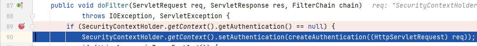

接着程序跳转到***ExceptionTranslationFilter***的<strong><i>doFilter()</i></strong>中，***ExceptionTranslationFilter***负责处理***FilterSecurityInterceptor***抛出的异常，我们在catch代码块的首行打上断点：

**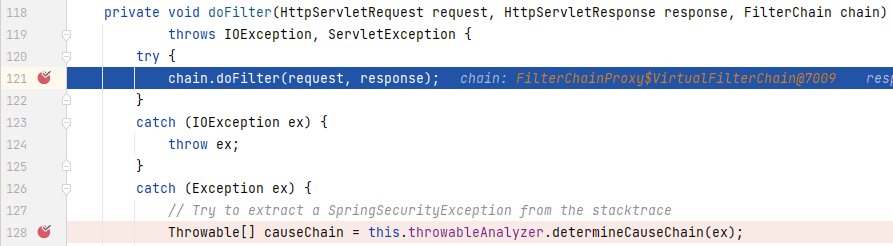**

接着程序跳转到***FilterSecurityInterceptor***的<strong><i>doFilter()</i></strong>中，依次执行代码后程序停留在其父类(***AbstractSecurityInterceptor***)的<strong><i>attemptAuthorization()</i></strong>中：

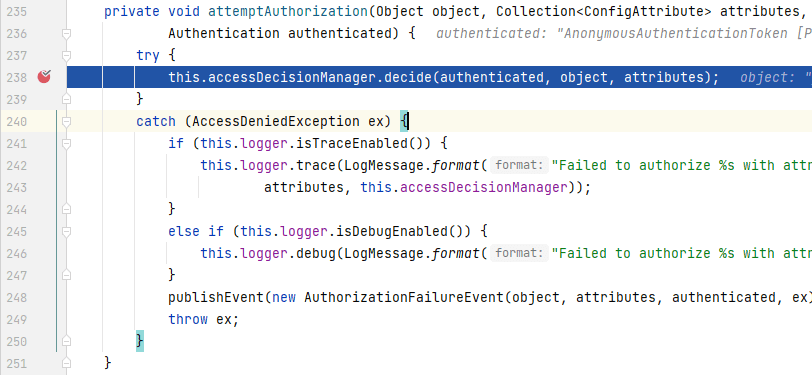

***accessDecisionManager***是***AccessDecisionManager***(访问决策器)的实例，***AccessDecisionManager***主要有3个实现类：***AffirmativeBased***(一票通过)，**ConsensusBased**(少数服从多数)、UnanimousBased(一票否决)，此时***AccessDecisionManager***的的实现类是***AffirmativeBased***，我们可以看到程序进入***AffirmativeBased***的<strong><i>decide()</i></strong>中：

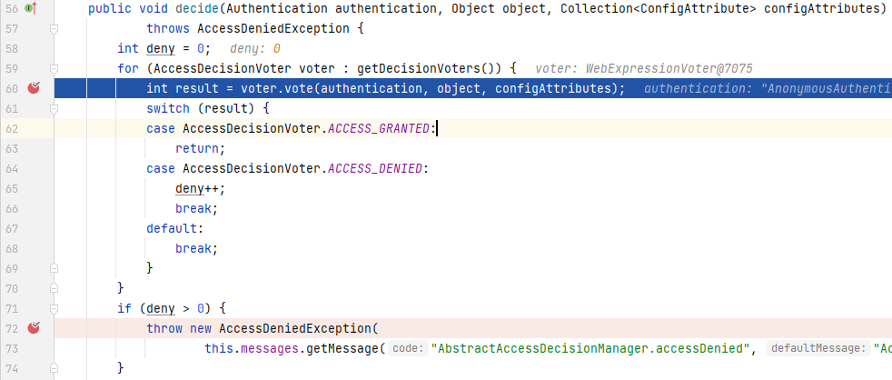

从上图可以看出，决策的关键在<strong><i>voter.vote(authentication, object, configAttributes)</i></strong>这句代码上，通过跟踪调试，程序最终进入***AuthenticationTrustResolverImpl***的<strong><i>isAnonymous()</i></strong>中：

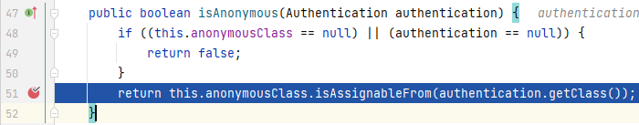

<strong><i>isAssignableFrom()</i></strong>判断前者是否是后者的父类，而***anonymousClass***被固定为***AnonymousAuthenticationToken.class***，参数***authentication***由前面***AnonymousAuthenticationFilter***可以知道是***AnonymousAuthenticationToken***的实例，因此<strong><i>isAnonymous()</i></strong>返回true，***FilterSecurityInterceptor***抛出***AccessDeniedException***异常，程序返回***ExceptionTranslationFilter***的catch块中：

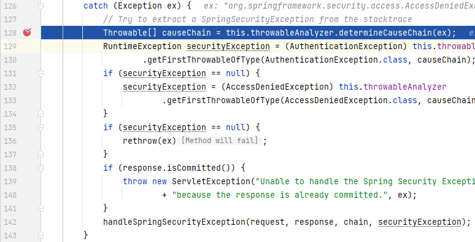

接着程序会依次进入***DelegatingAuthenticationEntryPoint***、***LoginUrlAuthenticationEntryPoint***中，最后由***LoginUrlAuthenticationEntryPoint***的<strong><i>commence()</i></strong>决定重定向到<strong><i>/login</i></strong>：

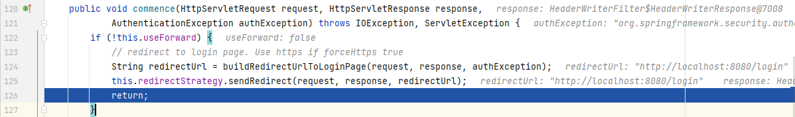

后续对<strong><i>/login</i></strong>的请求同样会经过之前的执行流程，在***DefaultLoginPageGeneratingFilter***的<strong><i>doFilter()</i></strong>中，通过<strong><i>isLoginUrlRequest()</i></strong>判定为true（请求路径是否是<strong><i>/login</i></strong>）,直接返回***login.html***，也就是我们开头看到的登录页面。

当我们输入用户名和密码，点击***Sign in***，程序来到***AbstractAuthenticationProcessingFilter***的<strong><i>doFilter()</i></strong>中，通过<strong><i>requiresAuthentication()</i></strong>判定为true（是否是POST请求）,因此交给其子类***UsernamePasswordAuthenticationFilter***进行处理，***UsernamePasswordAuthenticationFilter***会将用户名和密码封装成一个***UsernamePasswordAuthenticationToken***的实例并进行校验，当校验通过后会将请求重定向到我们一开始请求的路径：<strong><i>/hello</i></strong>。

后续对<strong><i>/hello</i></strong>的请求经过过滤器链时就可以一路开绿灯直到最终交由***HelloController***返回"Hello World"。

## 参考

1. [Spring Security Reference](https://docs.spring.io/spring-security/site/docs/current/reference/html5/)

2. [Spring Boot中开启Spring Security](https://mrbird.cc/Spring-Boot&Spring-Security.html)

