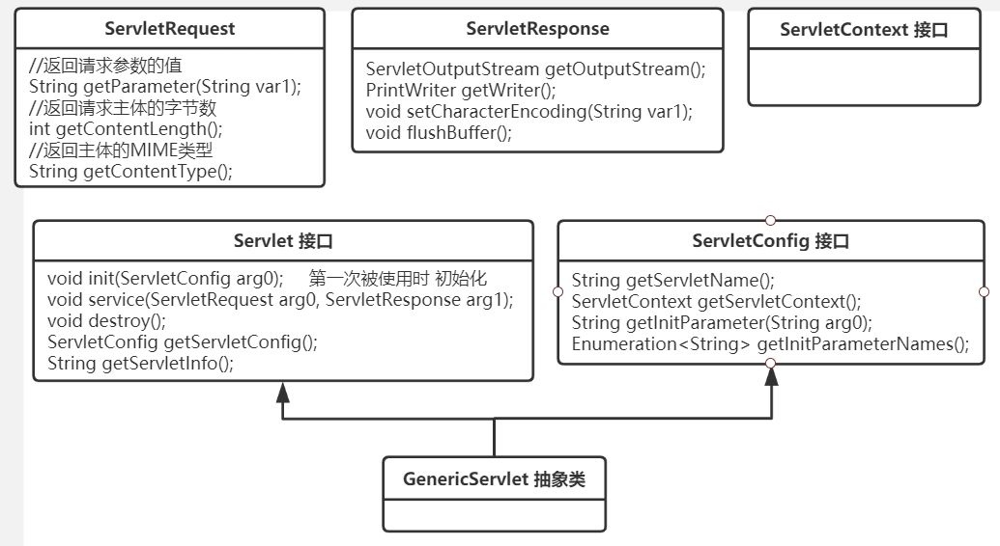

## Servlet 基础

### Servlet 简介

Servlet（Server Applet）是 J2EE 的内容之一，由 Java 编写的服务器端小程序。它是 web 请求的入口，主要功能在于交互式地（Request 和 Response）浏览和修改数据，生成动态 Web 内容。Servlet 运行于支持 Servlet 的 WEB 容器中，如 Tomcat。从实现上讲，Servlet 可以响应任何类型的请求，但绝大多数情况下 Servlet 只用来扩展基于 HTTP 协议 的 Web 服务器。servlet 的工作模式如下：

- 客户端发送请求至 WEB 服务器；
- 服务器根据请求的 URL 调用相应的 servlet 对象进行处理，获取到 servlet 对象的处理结果；
- 服务器将 响应内容 返回给客户端；

另外，由于各种 MVC 框架的兴起，现在几乎没人会直接使用 servlet 来处理请求咯，往往都是把 SpringMVC 在 Tomcat 中一配，各种请求都交由 DispatcherServlet 来分发。

### Servlet 生命周期

- 加载 : 客户端第一次访问该 Servlet 时，Tomcat 会创建该 Servlet 的实例，一般只创建 1 次，所以 servlet 对象 在 Tomcat 是单例的；
- 初始化 : Tomcat 调用 该 Servlet 的 init()方法 进行初始化；
- 服务 : 每当客户端访问 该 Servlet 时，Tomcat 就会调用一次该 Servlet 的 service()方法 处理请求；
- 销毁 : Tomcat 关闭时，会调用 这些 servlet 的 destroy()方法，让该实例释放掉所占的资源。

简单总结一下就是：只要访问 Servlet，service()方法 就会被调用，init()方法 只有第一次访问 Servlet 的时候才会被调用，destroy()方法 会在 Tomcat 关闭的时候被调用。

### &lt;load-on-startup&gt;

在 web.xml 中配置 Servlet 时有个属性 &lt;load-on-startup&gt;1&lt;/load-on-startup&gt;。翻译过来就是 “在启动时加载”，其作用如下：

1. load-on-startup 元素标记容器是否应该在 web 应用程序 启动的时候就加载这个 Servlet，实例化并调用其 init()方法；
2. 它的值必须是一个整数，表示 Servlet 被加载的先后顺序；
3. 如果值为正整数或者 0 时，表示容器在应用启动时就加载并初始化这个 Servlet，值越小，Servlet 的优先级越高，就越先被加载。值相同时，容器就会自己选择顺序来加载；
4. 如果该元素的值为负数或者没有设置，则容器会在 Servlet 被请求时才加载。

### Servlet 的多线程并发问题

servlet 对象 在 Tomcat 服务器中 是 单实例-多线程并发访问的，比如 DispatcherServlet 对象 只会被创建一次，但多个请求同时过来时，Tomcat 线程池 的多个工作线程就会并发地访问该 DispatcherServlet 对象。所以，若一个 servlet 对象中存在被并发修改的共享数据（成员变量 等），又没有加锁控制并发安全，就很可能会出现线程安全问题。

解决方案：

1. 把可能会并发修改的共享数据的代码块进行同步（使用 synchronized 或 Lock 对象）；
2. 建议在 Servlet 类 中尽量不要使用成员变量。若使用成员变量，则必须同步，并尽量缩小同步代码块的范围，以避免因为同步而导致并发效率降低。

### Servlet 实现请求和响应

对于每次客户端请求，Web 容器 都会创建一个新的 HttpServletRequest 请求对象 和 一个新的 HttpServletResponse 响应对象，然后将这两个对象作为参数传递给相应的 Servlet 对象 的 service()方法，service()方法 再根据请求方式分别调用 doGet()/doPost()/doXXX()方法。经过一系列业务层处理，最后将结果封装到 response 对象中，交由 Socket 对象传输响应给客户端。

## Servlet 源码解析

javax.servlet 包对 Servlet 规范 的一些主要行为和接口进行了定义和简单实现，它是 Servlet 规范 的体现，具体的实现交由下游厂商或开发者(如：Tomcat / Jetty)，就像体现了 JDBC 规范的 java.sql 包 一样，主要负责定义标准和规范。其源码和注释如下。

```java
public interface Servlet {
    /**
     * 初始化servlet
     */
    public abstract void init(ServletConfig servletconfig) throws ServletException;

    /**
     * 提供服务
     */
    public abstract void service(ServletRequest servletrequest, ServletResponse servletresponse)
            throws ServletException, IOException;

    /**
     * 销毁本servlet
     */
    public abstract void destroy();

    public abstract ServletConfig getServletConfig();

    public abstract String getServletInfo();
}

/**
 * ServletConfig 主要用于保存一些 servlet的配置信息，与 servlet对象 成对出现
 */
public interface ServletConfig {

    public abstract String getServletName();

    public abstract ServletContext getServletContext();

    public abstract String getInitParameter(String s);

    public abstract Enumeration getInitParameterNames();
}

/**
 * 一个web应用对应一个ServletContext，ServletContext实例包含了所有servlet共享的资源信息
 */
public interface ServletContext {

    public abstract ServletContext getContext(String s);

    public abstract Servlet getServlet(String s) throws ServletException;

    public abstract Enumeration getServlets();

    public abstract Enumeration getServletNames();

    public abstract int getMajorVersion();

    public abstract Set getResourcePaths(String s);

    public abstract URL getResource(String s) throws MalformedURLException;

    public abstract InputStream getResourceAsStream(String s);

    public abstract RequestDispatcher getRequestDispatcher(String s);

    public abstract RequestDispatcher getNamedDispatcher(String s);

    public abstract String getRealPath(String s);

    public abstract String getServerInfo();

    public abstract String getInitParameter(String s);

    public abstract Enumeration getInitParameterNames();

    public abstract Object getAttribute(String s);

    public abstract Enumeration getAttributeNames();

    public abstract void setAttribute(String s, Object obj);

    public abstract void removeAttribute(String s);

    public abstract String getServletContextName();
}

/**
 *定义了 Servlet 要处理的 Request请求信息，调用 Servlet 的 service()方法 时，会作为参数传入
 */
public interface ServletRequest {

    public abstract Object getAttribute(String s);

    public abstract Enumeration getAttributeNames();

    public abstract String getCharacterEncoding();

    public abstract void setCharacterEncoding(String s) throws UnsupportedEncodingException;

    public abstract int getContentLength();

    public abstract String getContentType();

    public abstract ServletInputStream getInputStream() throws IOException;

    public abstract String getParameter(String s);

    public abstract Enumeration getParameterNames();

    public abstract String[] getParameterValues(String s);

    public abstract Map getParameterMap();

    public abstract String getProtocol();

    public abstract String getScheme();

    public abstract String getServerName();

    public abstract int getServerPort();

    public abstract BufferedReader getReader() throws IOException;

    public abstract String getRemoteAddr();

    public abstract String getRemoteHost();

    public abstract void setAttribute(String s, Object obj);

    public abstract void removeAttribute(String s);

    public abstract Locale getLocale();

    public abstract Enumeration getLocales();

    public abstract boolean isSecure();

    public abstract RequestDispatcher getRequestDispatcher(String s);
}

/**
 * 定义了 Servlet 要返回的 Response响应信息，调用Servlet 的 service()方法 时，会作为参数传入
 */
public interface ServletResponse {

    public abstract String getCharacterEncoding();

    public abstract ServletOutputStream getOutputStream() throws IOException;

    public abstract PrintWriter getWriter() throws IOException;

    public abstract void setContentLength(int i);

    public abstract void setContentType(String s);

    public abstract void setBufferSize(int i);

    public abstract int getBufferSize();

    public abstract void flushBuffer() throws IOException;

    public abstract void resetBuffer();

    public abstract boolean isCommitted();

    public abstract void reset();

    public abstract void setLocale(Locale locale);

    public abstract Locale getLocale();
}
```

其主要部分的类图 如下。



下面看一下 javax.servlet.http 包下的内容，它提供了很多 我经常用到的类和接口，比如：HttpServlet、HttpServletRequest、HttpServletResponse。其源码如下。

```java
public abstract class HttpServlet extends GenericServlet implements Serializable {

    private static final String METHOD_DELETE = "DELETE";
    private static final String METHOD_HEAD = "HEAD";
    private static final String METHOD_GET = "GET";
    private static final String METHOD_OPTIONS = "OPTIONS";
    private static final String METHOD_POST = "POST";
    private static final String METHOD_PUT = "PUT";
    private static final String METHOD_TRACE = "TRACE";
    private static final String HEADER_IFMODSINCE = "If-Modified-Since";
    private static final String HEADER_LASTMOD = "Last-Modified";
    private static final String LSTRING_FILE = "javax.servlet.http.LocalStrings";
    private static ResourceBundle lStrings = ResourceBundle.getBundle("javax.servlet.http.LocalStrings");

    /**
     * 将 请求及响应 转换成 HttpServletRequest 及 HttpServletResponse，
     * 再调用 service() 的重载方法
     */
    public void service(ServletRequest req, ServletResponse res) throws ServletException, IOException {
        HttpServletRequest request;
        HttpServletResponse response;
        try {
            request = (HttpServletRequest) req;
            response = (HttpServletResponse) res;
        } catch (ClassCastException e) {
            throw new ServletException("non-HTTP request or response");
        }
        service(request, response);
    }

    /**
     * 对HTTP协议 各种类型的请求分别进行处理
     */
    protected void service(HttpServletRequest req, HttpServletResponse resp) throws ServletException, IOException {
        String method = req.getMethod();
        if (method.equals("GET")) {
            long lastModified = getLastModified(req);
            if (lastModified == -1L) {
                doGet(req, resp);
            } else {
                long ifModifiedSince = req.getDateHeader("If-Modified-Since");
                if (ifModifiedSince < (lastModified / 1000L) * 1000L) {
                    maybeSetLastModified(resp, lastModified);
                    doGet(req, resp);
                } else {
                    resp.setStatus(304);
                }
            }
        } else if (method.equals("HEAD")) {
            long lastModified = getLastModified(req);
            maybeSetLastModified(resp, lastModified);
            doHead(req, resp);
        } else if (method.equals("POST"))
            doPost(req, resp);
        else if (method.equals("PUT"))
            doPut(req, resp);
        else if (method.equals("DELETE"))
            doDelete(req, resp);
        else if (method.equals("OPTIONS"))
            doOptions(req, resp);
        else if (method.equals("TRACE")) {
            doTrace(req, resp);
        } else {
            String errMsg = lStrings.getString("http.method_not_implemented");
            Object errArgs[] = new Object[1];
            errArgs[0] = method;
            errMsg = MessageFormat.format(errMsg, errArgs);
            resp.sendError(501, errMsg);
        }
    }

    protected void doGet(HttpServletRequest req, HttpServletResponse resp) throws ServletException, IOException {
        String protocol = req.getProtocol();
        String msg = lStrings.getString("http.method_get_not_supported");
        if (protocol.endsWith("1.1"))
            resp.sendError(405, msg);
        else
            resp.sendError(400, msg);
    }

    protected long getLastModified(HttpServletRequest req) {
        return -1L;
    }

    protected void doHead(HttpServletRequest req, HttpServletResponse resp) throws ServletException, IOException {
        NoBodyResponse response = new NoBodyResponse(resp);
        doGet(req, response);
        response.setContentLength();
    }

    protected void doPost(HttpServletRequest req, HttpServletResponse resp) throws ServletException, IOException {
        String protocol = req.getProtocol();
        String msg = lStrings.getString("http.method_post_not_supported");
        if (protocol.endsWith("1.1"))
            resp.sendError(405, msg);
        else
            resp.sendError(400, msg);
    }

    protected void doPut(HttpServletRequest req, HttpServletResponse resp) throws ServletException, IOException {
        String protocol = req.getProtocol();
        String msg = lStrings.getString("http.method_put_not_supported");
        if (protocol.endsWith("1.1"))
            resp.sendError(405, msg);
        else
            resp.sendError(400, msg);
    }

    protected void doDelete(HttpServletRequest req, HttpServletResponse resp) throws ServletException, IOException {
        String protocol = req.getProtocol();
        String msg = lStrings.getString("http.method_delete_not_supported");
        if (protocol.endsWith("1.1"))
            resp.sendError(405, msg);
        else
            resp.sendError(400, msg);
    }

    private Method[] getAllDeclaredMethods(Class c) {
        if (c.getName().equals("javax.servlet.http.HttpServlet"))
            return null;
        int j = 0;
        Method parentMethods[] = getAllDeclaredMethods(c.getSuperclass());
        Method thisMethods[] = c.getDeclaredMethods();
        if (parentMethods != null) {
            Method allMethods[] = new Method[parentMethods.length + thisMethods.length];
            for (int i = 0; i < parentMethods.length; i++) {
                allMethods[i] = parentMethods[i];
                j = i;
            }

            for (int i = ++j; i < thisMethods.length + j; i++)
                allMethods[i] = thisMethods[i - j];

            return allMethods;
        } else {
            return thisMethods;
        }
    }

    protected void doOptions(HttpServletRequest req, HttpServletResponse resp) throws ServletException, IOException {
        Method methods[] = getAllDeclaredMethods(getClass());
        boolean ALLOW_GET = false;
        boolean ALLOW_HEAD = false;
        boolean ALLOW_POST = false;
        boolean ALLOW_PUT = false;
        boolean ALLOW_DELETE = false;
        boolean ALLOW_TRACE = true;
        boolean ALLOW_OPTIONS = true;
        for (int i = 0; i < methods.length; i++) {
            Method m = methods[i];
            if (m.getName().equals("doGet")) {
                ALLOW_GET = true;
                ALLOW_HEAD = true;
            }
            if (m.getName().equals("doPost"))
                ALLOW_POST = true;
            if (m.getName().equals("doPut"))
                ALLOW_PUT = true;
            if (m.getName().equals("doDelete"))
                ALLOW_DELETE = true;
        }

        String allow = null;
        if (ALLOW_GET && allow == null)
            allow = "GET";
        if (ALLOW_HEAD)
            if (allow == null)
                allow = "HEAD";
            else
                allow = allow + ", HEAD";
        if (ALLOW_POST)
            if (allow == null)
                allow = "POST";
            else
                allow = allow + ", POST";
        if (ALLOW_PUT)
            if (allow == null)
                allow = "PUT";
            else
                allow = allow + ", PUT";
        if (ALLOW_DELETE)
            if (allow == null)
                allow = "DELETE";
            else
                allow = allow + ", DELETE";
        if (ALLOW_TRACE)
            if (allow == null)
                allow = "TRACE";
            else
                allow = allow + ", TRACE";
        if (ALLOW_OPTIONS)
            if (allow == null)
                allow = "OPTIONS";
            else
                allow = allow + ", OPTIONS";
        resp.setHeader("Allow", allow);
    }

    protected void doTrace(HttpServletRequest req, HttpServletResponse resp) throws ServletException, IOException {
        String CRLF = "\r\n";
        String responseString = "TRACE " + req.getRequestURI() + " " + req.getProtocol();
        for (Enumeration reqHeaderEnum = req.getHeaderNames(); reqHeaderEnum.hasMoreElements();) {
            String headerName = (String) reqHeaderEnum.nextElement();
            responseString = responseString + CRLF + headerName + ": " + req.getHeader(headerName);
        }

        responseString = responseString + CRLF;
        int responseLength = responseString.length();
        resp.setContentType("message/http");
        resp.setContentLength(responseLength);
        ServletOutputStream out = resp.getOutputStream();
        out.print(responseString);
        out.close();
    }

    private void maybeSetLastModified(HttpServletResponse resp, long lastModified) {
        if (resp.containsHeader("Last-Modified"))
            return;
        if (lastModified >= 0L)
            resp.setDateHeader("Last-Modified", lastModified);
    }
}

/**
 * 对 HTTP 请求信息进行定义
 */
public interface HttpServletRequest extends ServletRequest {

    public static final String BASIC_AUTH = "BASIC";
    public static final String FORM_AUTH = "FORM";
    public static final String CLIENT_CERT_AUTH = "CLIENT_CERT";
    public static final String DIGEST_AUTH = "DIGEST";

    public abstract String getAuthType();

    public abstract Cookie[] getCookies();

    public abstract long getDateHeader(String s);

    public abstract String getHeader(String s);

    public abstract Enumeration getHeaders(String s);

    public abstract Enumeration getHeaderNames();

    public abstract int getIntHeader(String s);

    public abstract String getMethod();

    public abstract String getPathInfo();

    public abstract String getPathTranslated();

    public abstract String getContextPath();

    public abstract String getQueryString();

    public abstract String getRemoteUser();

    public abstract boolean isUserInRole(String s);

    public abstract Principal getUserPrincipal();

    public abstract String getRequestedSessionId();

    public abstract String getRequestURI();

    public abstract StringBuffer getRequestURL();

    public abstract String getServletPath();

    public abstract HttpSession getSession(boolean flag);

    public abstract HttpSession getSession();

    public abstract boolean isRequestedSessionIdValid();

    public abstract boolean isRequestedSessionIdFromCookie();

    public abstract boolean isRequestedSessionIdFromURL();
}

/**
 * 对 HTTP 响应信息进行定义
 */
public interface HttpServletResponse extends ServletResponse {

    public static final int SC_CONTINUE = 100;
    public static final int SC_SWITCHING_PROTOCOLS = 101;
    public static final int SC_OK = 200;
    public static final int SC_CREATED = 201;
    public static final int SC_ACCEPTED = 202;
    public static final int SC_NON_AUTHORITATIVE_INFORMATION = 203;
    public static final int SC_NO_CONTENT = 204;
    public static final int SC_RESET_CONTENT = 205;
    public static final int SC_PARTIAL_CONTENT = 206;
    public static final int SC_MULTIPLE_CHOICES = 300;
    public static final int SC_MOVED_PERMANENTLY = 301;
    public static final int SC_MOVED_TEMPORARILY = 302;
    public static final int SC_SEE_OTHER = 303;
    public static final int SC_NOT_MODIFIED = 304;
    public static final int SC_USE_PROXY = 305;
    public static final int SC_TEMPORARY_REDIRECT = 307;
    public static final int SC_BAD_REQUEST = 400;
    public static final int SC_UNAUTHORIZED = 401;
    public static final int SC_PAYMENT_REQUIRED = 402;
    public static final int SC_FORBIDDEN = 403;
    public static final int SC_NOT_FOUND = 404;
    public static final int SC_METHOD_NOT_ALLOWED = 405;
    public static final int SC_NOT_ACCEPTABLE = 406;
    public static final int SC_PROXY_AUTHENTICATION_REQUIRED = 407;
    public static final int SC_REQUEST_TIMEOUT = 408;
    public static final int SC_CONFLICT = 409;
    public static final int SC_GONE = 410;
    public static final int SC_LENGTH_REQUIRED = 411;
    public static final int SC_PRECONDITION_FAILED = 412;
    public static final int SC_REQUEST_ENTITY_TOO_LARGE = 413;
    public static final int SC_REQUEST_URI_TOO_LONG = 414;
    public static final int SC_UNSUPPORTED_MEDIA_TYPE = 415;
    public static final int SC_REQUESTED_RANGE_NOT_SATISFIABLE = 416;
    public static final int SC_EXPECTATION_FAILED = 417;
    public static final int SC_INTERNAL_SERVER_ERROR = 500;
    public static final int SC_NOT_IMPLEMENTED = 501;
    public static final int SC_BAD_GATEWAY = 502;
    public static final int SC_SERVICE_UNAVAILABLE = 503;
    public static final int SC_GATEWAY_TIMEOUT = 504;
    public static final int SC_HTTP_VERSION_NOT_SUPPORTED = 505;

    public abstract void addCookie(Cookie cookie);

    public abstract boolean containsHeader(String s);

    public abstract String encodeURL(String s);

    public abstract String encodeRedirectURL(String s);

    public abstract void sendError(int i, String s) throws IOException;

    public abstract void sendError(int i) throws IOException;

    public abstract void sendRedirect(String s) throws IOException;

    public abstract void setDateHeader(String s, long l);

    public abstract void addDateHeader(String s, long l);

    public abstract void setHeader(String s, String s1);

    public abstract void addHeader(String s, String s1);

    public abstract void setIntHeader(String s, int i);

    public abstract void addIntHeader(String s, int i);

    public abstract void setStatus(int i);
}
```
