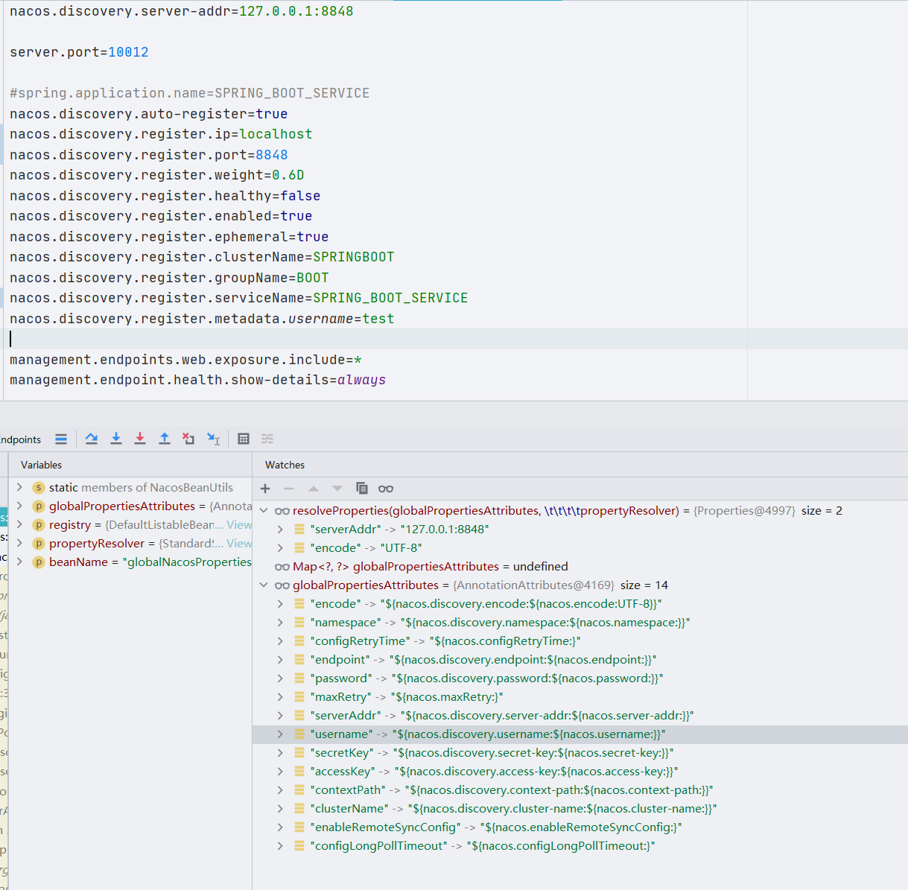
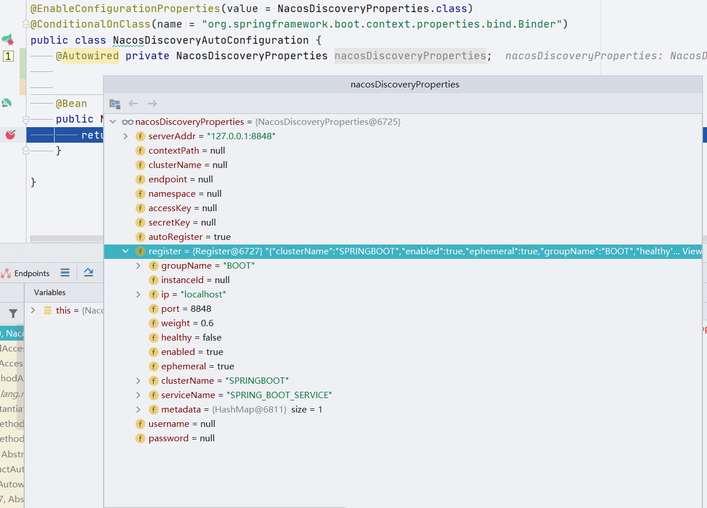
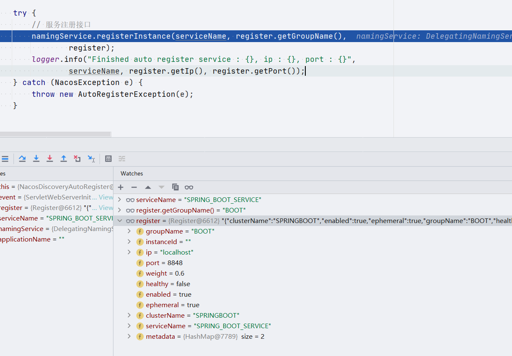
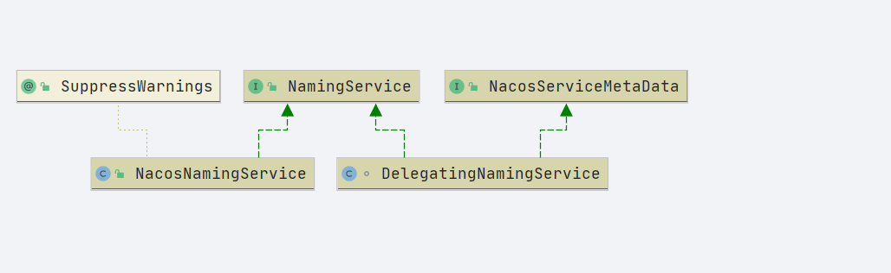

# Nacos 服务注册

- nacos-spring-boot-project 中有关服务注册的几个项目
  - nacos-discovery-spring-boot-actuator
    nacos-discovery-spring-boot-autoconfigure
    nacos-discovery-spring-boot-starter

```properties
org.springframework.boot.autoconfigure.EnableAutoConfiguration=\
  com.alibaba.boot.nacos.discovery.autoconfigure.NacosDiscoveryAutoConfiguration
```

找到类 `NacosDiscoveryAutoConfiguration`

```java
@ConditionalOnProperty(name = NacosDiscoveryConstants.ENABLED, matchIfMissing = true)
@ConditionalOnMissingBean(name = DISCOVERY_GLOBAL_NACOS_PROPERTIES_BEAN_NAME)
@EnableNacosDiscovery
@EnableConfigurationProperties(value = NacosDiscoveryProperties.class)
@ConditionalOnClass(name = "org.springframework.boot.context.properties.bind.Binder")
    public class NacosDiscoveryAutoConfiguration {

 @Bean
 public NacosDiscoveryAutoRegister discoveryAutoRegister() {
  return new NacosDiscoveryAutoRegister();
 }

}
```

- 注解:`EnableNacosDiscovery`

```java
@Target({ ElementType.TYPE, ElementType.ANNOTATION_TYPE })
@Retention(RetentionPolicy.RUNTIME)
@Documented
@Import(NacosDiscoveryBeanDefinitionRegistrar.class)
public @interface EnableNacosDiscovery {}
```

- import 类 :`NacosDiscoveryBeanDefinitionRegistrar`

```java
public class NacosDiscoveryBeanDefinitionRegistrar
      implements ImportBeanDefinitionRegistrar, EnvironmentAware {

   private Environment environment;

   @Override
   public void registerBeanDefinitions(AnnotationMetadata importingClassMetadata,
         BeanDefinitionRegistry registry) {
      AnnotationAttributes attributes = AnnotationAttributes
            .fromMap(importingClassMetadata
                  .getAnnotationAttributes(EnableNacosDiscovery.class.getName()));
      // Register Global Nacos Properties Bean
      registerGlobalNacosProperties(attributes, registry, environment,
            DISCOVERY_GLOBAL_NACOS_PROPERTIES_BEAN_NAME);
      registerGlobalNacosProperties(attributes, registry, environment,
            MAINTAIN_GLOBAL_NACOS_PROPERTIES_BEAN_NAME);
      // Register Nacos Common Beans
      registerNacosCommonBeans(registry);
      // Register Nacos Discovery Beans
      registerNacosDiscoveryBeans(registry);
   }

   @Override
   public void setEnvironment(Environment environment) {
      this.environment = environment;
   }
}
```

- 两个流程

  1. 将注解`EnableNacosDiscovery`的属性读取,放入到 nacos 的全局属性配置中

  2. bean 注入

## nacos 全局配置属性

- `com.alibaba.nacos.spring.context.annotation.discovery.NacosDiscoveryBeanDefinitionRegistrar#registerBeanDefinitions`
  - `com.alibaba.nacos.spring.util.NacosBeanUtils#registerGlobalNacosProperties(org.springframework.core.annotation.AnnotationAttributes, org.springframework.beans.factory.support.BeanDefinitionRegistry, org.springframework.core.env.PropertyResolver, java.lang.String)`

```java
public static void registerGlobalNacosProperties(AnnotationAttributes attributes,
      BeanDefinitionRegistry registry, PropertyResolver propertyResolver,
      String beanName) {
   if (attributes == null) {
      return; // Compatible with null
   }
   AnnotationAttributes globalPropertiesAttributes = attributes
         .getAnnotation("globalProperties");
   registerGlobalNacosProperties((Map<?, ?>) globalPropertiesAttributes, registry,
         propertyResolver, beanName);
}
```

- 贴出注解上的信息

```java
	NacosProperties globalProperties() default @NacosProperties(username = USERNAME_PLACEHOLDER, password = PASSWORD_PLACEHOLDER, endpoint = ENDPOINT_PLACEHOLDER, namespace = NAMESPACE_PLACEHOLDER, accessKey = ACCESS_KEY_PLACEHOLDER, secretKey = SECRET_KEY_PLACEHOLDER, serverAddr = SERVER_ADDR_PLACEHOLDER, contextPath = CONTEXT_PATH_PLACEHOLDER, clusterName = CLUSTER_NAME_PLACEHOLDER, encode = ENCODE_PLACEHOLDER);

```

- 通过下面这段代码会将注解信息获取到对象`AnnotationAttributes globalPropertiesAttributes`中

  ```java
  AnnotationAttributes globalPropertiesAttributes = attributes
        .getAnnotation("globalProperties");
  ```

- 下一段代码是将属性换算出来

  ```java
  registerGlobalNacosProperties((Map<?, ?>) globalPropertiesAttributes, registry,
        propertyResolver, beanName)


      	public static void registerGlobalNacosProperties(Map<?, ?> globalPropertiesAttributes,
  			BeanDefinitionRegistry registry, PropertyResolver propertyResolver,
  			String beanName) {
  		// 占位符解析成具体的配置信息
  		Properties globalProperties = resolveProperties(globalPropertiesAttributes,
  				propertyResolver);
  		// 单例注册
  		registerSingleton(registry, beanName, globalProperties);
  	}

  ```



## registerNacosCommonBeans

```
public static void registerNacosCommonBeans(BeanDefinitionRegistry registry) {
   // Register NacosApplicationContextHolder Bean
   registerNacosApplicationContextHolder(registry);
   // Register AnnotationNacosInjectedBeanPostProcessor Bean
   registerAnnotationNacosInjectedBeanPostProcessor(registry);
}
```

- 主要方法: registerInfrastructureBean
  1. 定义出 bean
  2. 设置构造参数
  3. 注册对象

```java
public static void registerInfrastructureBean(BeanDefinitionRegistry registry,
      String beanName, Class<?> beanClass, Object... constructorArgs) {
   // Build a BeanDefinition for NacosServiceFactory class
   // 定义出 bean 根据类型
   BeanDefinitionBuilder beanDefinitionBuilder = BeanDefinitionBuilder
         .rootBeanDefinition(beanClass);
   for (Object constructorArg : constructorArgs) {
      beanDefinitionBuilder.addConstructorArgValue(constructorArg);
   }
   // ROLE_INFRASTRUCTURE
   beanDefinitionBuilder.setRole(BeanDefinition.ROLE_INFRASTRUCTURE);
   // Register
   registry.registerBeanDefinition(beanName,
         beanDefinitionBuilder.getBeanDefinition());
}
```

## @EnableConfigurationProperties(value = NacosDiscoveryProperties.class)

属性读取，从 application 配置文件中读取数据转换成 java 对象。



## NacosDiscoveryAutoRegister

```java
public class NacosDiscoveryAutoRegister
        implements ApplicationListener<WebServerInitializedEvent> {}
```

- 处理一个`WebServerInitializedEvent` 事件的方法

- 重写方法如下，主要工作内容
  1. 把服务发现配置读取出来
  2. 设置一些数据值
  3. 调用服务注册接口

```java
@Override
public void onApplicationEvent(WebServerInitializedEvent event) {

    if (!discoveryProperties.isAutoRegister()) {
        return;
    }

    Register register = discoveryProperties.getRegister();

    if (StringUtils.isEmpty(register.getIp())) {
        register.setIp(NetUtils.localIP());
    }

    if (register.getPort() == 0) {
        register.setPort(event.getWebServer().getPort());
    }

    register.getMetadata().put("preserved.register.source", "SPRING_BOOT");

    register.setInstanceId("");

    String serviceName = register.getServiceName();

    if (StringUtils.isEmpty(serviceName)){
        if (StringUtils.isEmpty(applicationName)){
            throw new AutoRegisterException("serviceName notNull");
        }
        serviceName = applicationName;
    }

    try {
        namingService.registerInstance(serviceName, register.getGroupName(),
                register);
        logger.info("Finished auto register service : {}, ip : {}, port : {}",
                serviceName, register.getIp(), register.getPort());
    } catch (NacosException e) {
        throw new AutoRegisterException(e);
    }
}
```

- 注册的参数

  

## 服务注册



- 注册一个实例
  1. 将 instance 对象转换成 BeatInfo 对象
  2. 注册实例

```java
    @Override
    public void registerInstance(String serviceName, String groupName, Instance instance) throws NacosException {

        if (instance.isEphemeral()) {
            // 实例信息转换
            BeatInfo beatInfo = new BeatInfo();
            beatInfo.setServiceName(NamingUtils.getGroupedName(serviceName, groupName));
            beatInfo.setIp(instance.getIp());
            beatInfo.setPort(instance.getPort());
            beatInfo.setCluster(instance.getClusterName());
            beatInfo.setWeight(instance.getWeight());
            beatInfo.setMetadata(instance.getMetadata());
            beatInfo.setScheduled(false);
            beatInfo.setPeriod(instance.getInstanceHeartBeatInterval());
            // 插入这条实例的信息
            beatReactor.addBeatInfo(NamingUtils.getGroupedName(serviceName, groupName),
                    beatInfo);
        }

        serverProxy.registerService(NamingUtils.getGroupedName(serviceName, groupName), groupName, instance);
    }

```

- addBeatInfo
  - 创建了一个定时任务 BeatTask

```java
public void addBeatInfo(String serviceName, BeatInfo beatInfo) {
    NAMING_LOGGER.info("[BEAT] adding beat: {} to beat map.", beatInfo);
    String key = buildKey(serviceName, beatInfo.getIp(), beatInfo.getPort());
    BeatInfo existBeat = null;
    //fix #1733
    if ((existBeat = dom2Beat.remove(key)) != null) {
        existBeat.setStopped(true);
    }
    dom2Beat.put(key, beatInfo);
    executorService.schedule(new BeatTask(beatInfo), beatInfo.getPeriod(), TimeUnit.MILLISECONDS);
    MetricsMonitor.getDom2BeatSizeMonitor().set(dom2Beat.size());
}
```

### BeatTask

```
class BeatTask implements Runnable {

    BeatInfo beatInfo;

    public BeatTask(BeatInfo beatInfo) {
        this.beatInfo = beatInfo;
    }

    @Override
    public void run() {
        if (beatInfo.isStopped()) {
            return;
        }
        long nextTime = beatInfo.getPeriod();
        try {
        	// 与nacos进行一次rest请求交互
            JSONObject result = serverProxy.sendBeat(beatInfo, BeatReactor.this.lightBeatEnabled);
            long interval = result.get(CLIENT_BEAT_INTERVAL_FIELD).asLong();
            boolean lightBeatEnabled = false;
            if (result.has(CommonParams.LIGHT_BEAT_ENABLED)) {
                lightBeatEnabled = result.get(CommonParams.LIGHT_BEAT_ENABLED).asBoolean();
            }
            BeatReactor.this.lightBeatEnabled = lightBeatEnabled;
            if (interval > 0) {
                nextTime = interval;
            }
            int code = NamingResponseCode.OK;
            if (result.has(CommonParams.CODE)) {
                code = result.get(CommonParams.CODE).asInt();
            }
            // 如果nacos找不到当前实例,
            if (code == NamingResponseCode.RESOURCE_NOT_FOUND) {
                Instance instance = new Instance();
                instance.setPort(beatInfo.getPort());
                instance.setIp(beatInfo.getIp());
                instance.setWeight(beatInfo.getWeight());
                instance.setMetadata(beatInfo.getMetadata());
                instance.setClusterName(beatInfo.getCluster());
                instance.setServiceName(beatInfo.getServiceName());
                instance.setInstanceId(instance.getInstanceId());
                instance.setEphemeral(true);
                try {
                	// 执行注册服务
                    serverProxy.registerService(beatInfo.getServiceName(),
                        NamingUtils.getGroupName(beatInfo.getServiceName()), instance);
                } catch (Exception ignore) {
                }
            }
        } catch (NacosException ne) {
            NAMING_LOGGER.error("[CLIENT-BEAT] failed to send beat: {}, code: {}, msg: {}",
                JSON.toJSONString(beatInfo), ne.getErrCode(), ne.getErrMsg());

        } catch (Exception unknownEx) {
                NAMING_LOGGER.error("[CLIENT-BEAT] failed to send beat: {}, unknown exception msg: {}",
                        JacksonUtils.toJson(beatInfo), unknownEx.getMessage(), unknownEx);
        } finally {
                executorService.schedule(new BeatTask(beatInfo), nextTime, TimeUnit.MILLISECONDS);
        }
    }
}
```

- 定时任务说明

  1. 和 nacos 进行一次交互，根据交互结果的 code 判断,如果不在 nacos 会执行注册.

- 发送请求的方法

  ```java
  public String reqAPI(String api, Map<String, String> params, String body, List<String> servers, String method) throws NacosException {

      params.put(CommonParams.NAMESPACE_ID, getNamespaceId());

      if (CollectionUtils.isEmpty(servers) && StringUtils.isEmpty(nacosDomain)) {
          throw new NacosException(NacosException.INVALID_PARAM, "no server available");
      }

      NacosException exception = new NacosException();

      if (serverListManager.isDomain()) {
            String nacosDomain = serverListManager.getNacosDomain();
            for (int i = 0; i < maxRetry; i++) {
                try {
                    return callServer(api, params, body, nacosDomain, method);
                } catch (NacosException e) {
                    exception = e;
                    if (NAMING_LOGGER.isDebugEnabled()) {
                        NAMING_LOGGER.debug("request {} failed.", nacosDomain, e);
                    }
                }
            }
        } else {
            Random random = new Random(System.currentTimeMillis());
            int index = random.nextInt(servers.size());

            for (int i = 0; i < servers.size(); i++) {
                String server = servers.get(index);
                try {
                    return callServer(api, params, body, server, method);
                } catch (NacosException e) {
                    exception = e;
                    if (NAMING_LOGGER.isDebugEnabled()) {
                        NAMING_LOGGER.debug("request {} failed.", server, e);
                    }
                }
                index = (index + 1) % servers.size();
            }
        }

        NAMING_LOGGER.error("request: {} failed, servers: {}, code: {}, msg: {}", api, servers, exception.getErrCode(),
                exception.getErrMsg());

        throw new NacosException(exception.getErrCode(),
                "failed to req API:" + api + " after all servers(" + servers + ") tried: " + exception.getMessage());
  ```

**学习点**

- 这里采用随机值作为第一个 server 的获取，主要目的是为了将请求随机分配给不同的 nacos 服务

  如果直接使用 for 循环的索引那第一台 nacos 服务会收到所有的请求，直到这台服务坏了才会请求第二台

        Random random = new Random(System.currentTimeMillis());
        int index = random.nextInt(servers.size());

        for (int i = 0; i < servers.size(); i++) {
            // 获取nacos所在的ip+port地址
            String server = servers.get(index);
            try {
                // 进行请求
                return callServer(api, params, body, server, method);
            } catch (NacosException e) {
                exception = e;
                if (NAMING_LOGGER.isDebugEnabled()) {
                    NAMING_LOGGER.debug("request {} failed.", server, e);
                }
            }
            index = (index + 1) % servers.size();
        }

  }

### registerService

- 注册方法就是请求一次接口，将数据发送给 nacos 就完成了

```java
public void registerService(String serviceName, String groupName, Instance instance) throws NacosException {

    NAMING_LOGGER.info("[REGISTER-SERVICE] {} registering service {} with instance: {}",
        namespaceId, serviceName, instance);
    String groupedServiceName = NamingUtils.getGroupedName(serviceName, groupName);
    if (instance.isEphemeral()) {
        BeatInfo beatInfo = beatReactor.buildBeatInfo(groupedServiceName, instance);
        beatReactor.addBeatInfo(groupedServiceName, beatInfo);
    }

    final Map<String, String> params = new HashMap<String, String>(32);
    params.put(CommonParams.NAMESPACE_ID, namespaceId);
    params.put(CommonParams.SERVICE_NAME, groupedServiceName);
    params.put(CommonParams.GROUP_NAME, groupName);
    params.put(CommonParams.CLUSTER_NAME, instance.getClusterName());
    params.put(IP_PARAM, instance.getIp());
    params.put(PORT_PARAM, String.valueOf(instance.getPort()));
    params.put(WEIGHT_PARAM, String.valueOf(instance.getWeight()));
    params.put(REGISTER_ENABLE_PARAM, String.valueOf(instance.isEnabled()));
    params.put(HEALTHY_PARAM, String.valueOf(instance.isHealthy()));
    params.put(EPHEMERAL_PARAM, String.valueOf(instance.isEphemeral()));
    params.put(META_PARAM, JacksonUtils.toJson(instance.getMetadata()));

    reqAPI(UtilAndComs.NACOS_URL_INSTANCE, params, HttpMethod.POST);

}
```

- 服务注册的接口

  - `/nacos/v1/ns/instance`
  - `/nacos/v1/ns/instance/beat`

- 接下来去寻找这两个接口的实现

  `com.alibaba.nacos.naming.controllers.InstanceController`

## nacos 服务端

### 实例注册

```java
public void registerInstance(String namespaceId, String serviceName, Instance instance) throws NacosException {
	// 创建空服务
    createEmptyService(namespaceId, serviceName, instance.isEphemeral());

    Service service = getService(namespaceId, serviceName);

    if (service == null) {
        throw new NacosException(NacosException.INVALID_PARAM,
            "service not found, namespace: " + namespaceId + ", service: " + serviceName);
    }

    addInstance(namespaceId, serviceName, instance.isEphemeral(), instance);
}
```

- 创建空服务的流程

  - 获取服务对象

    nacos 的服务信息存储在

    `com.alibaba.nacos.naming.core.ServiceManager#serviceMap`

    ```java
    private Map<String, Map<String, Service>> serviceMap = new ConcurrentHashMap<>();
    ```

```java
public void createServiceIfAbsent(String namespaceId, String serviceName, boolean local, Cluster cluster) throws NacosException {
    // 获取服务信息
    Service service = getService(namespaceId, serviceName);
    if (service == null) {

        Loggers.SRV_LOG.info("creating empty service {}:{}", namespaceId, serviceName);
        service = new Service();
        service.setName(serviceName);
        service.setNamespaceId(namespaceId);
        service.setGroupName(NamingUtils.getGroupName(serviceName));
        // now validate the service. if failed, exception will be thrown
        service.setLastModifiedMillis(System.currentTimeMillis());
        service.recalculateChecksum();
        if (cluster != null) {
            cluster.setService(service);
            service.getClusterMap().put(cluster.getName(), cluster);
        }
        service.validate();

        putServiceAndInit(service);
        if (!local) {
            addOrReplaceService(service);
        }
    }
}
```

- 在了解 map 结构后不难理解下面这个获取 Service 的方法了

```java
public Service getService(String namespaceId, String serviceName) {
    if (serviceMap.get(namespaceId) == null) {
        return null;
    }
    return chooseServiceMap(namespaceId).get(serviceName);
}
```

```java
private void putServiceAndInit(Service service) throws NacosException {
    putService(service);
    service.init();
    consistencyService.listen(KeyBuilder.buildInstanceListKey(service.getNamespaceId(), service.getName(), true), service);
    consistencyService.listen(KeyBuilder.buildInstanceListKey(service.getNamespaceId(), service.getName(), false), service);
    Loggers.SRV_LOG.info("[NEW-SERVICE] {}", service.toJSON());
}
```

- 把服务加入 map 对象

```java
public void putService(Service service) {
    if (!serviceMap.containsKey(service.getNamespaceId())) {
        synchronized (putServiceLock) {
            if (!serviceMap.containsKey(service.getNamespaceId())) {
                serviceMap.put(service.getNamespaceId(), new ConcurrentHashMap<>(16));
            }
        }
    }
    serviceMap.get(service.getNamespaceId()).put(service.getName(), service);
}
```

- init 方法设置了一个数据验证的任务 ， 并且在集群中设置 service 信息

```java
public void init() {

    HealthCheckReactor.scheduleCheck(clientBeatCheckTask);

    for (Map.Entry<String, Cluster> entry : clusterMap.entrySet()) {
        entry.getValue().setService(this);
        entry.getValue().init();
    }
}
```

- 再往后添加两个 key 的监听

- addInstance 方法

```java
public void addInstance(String namespaceId, String serviceName, boolean ephemeral, Instance... ips) throws NacosException {

    String key = KeyBuilder.buildInstanceListKey(namespaceId, serviceName, ephemeral);

    Service service = getService(namespaceId, serviceName);

    synchronized (service) {
        List<Instance> instanceList = addIpAddresses(service, ephemeral, ips);

        Instances instances = new Instances();
        instances.setInstanceList(instanceList);

        consistencyService.put(key, instances);
    }
}
```

- 简单理解 consistencyService 结构信息
  - key： 定义的一个名字
  - value : 实例的列表

### 实例健康检查

- 获取实例独享, 从 service 中根据集群名称获取实例列表 ， 再根据 ip + 端口 返回实例对象

```java
Instance instance = serviceManager.getInstance(namespaceId, serviceName, clusterName, ip, port);
```

```java
public Instance getInstance(String namespaceId, String serviceName, String cluster, String ip, int port) {
    Service service = getService(namespaceId, serviceName);
    if (service == null) {
        return null;
    }

    List<String> clusters = new ArrayList<>();
    clusters.add(cluster);

    List<Instance> ips = service.allIPs(clusters);
    if (ips == null || ips.isEmpty()) {
        return null;
    }

    for (Instance instance : ips) {
        if (instance.getIp().equals(ip) && instance.getPort() == port) {
            return instance;
        }
    }

    return null;
}
```

- 实例健康检查接口做的事件
  1. 获取实例
     1. 实例不存在注册实例
  2. 获取服务
     1. 服务不存在抛出异常
     2. 服务存在执行一个心跳方法
  3. 组装结果返回

```java
@CanDistro
@PutMapping("/beat")
@Secured(action = ActionTypes.WRITE)
public ObjectNode beat(@RequestParam(defaultValue = Constants.DEFAULT_NAMESPACE_ID) String namespaceId,
          @RequestParam String serviceName,
          @RequestParam(defaultValue = StringUtils.EMPTY) String ip,
          @RequestParam(defaultValue = UtilsAndCommons.DEFAULT_CLUSTER_NAME) String clusterName,
          @RequestParam(defaultValue = "0") Integer port,
          @RequestParam(defaultValue = StringUtils.EMPTY) String beat)throws Exception {

      ObjectNode result = JacksonUtils.createEmptyJsonNode();
      result.put(SwitchEntry.CLIENT_BEAT_INTERVAL, switchDomain.getClientBeatInterval());
      RsInfo clientBeat = null;
      if (StringUtils.isNotBlank(beat)) {
          clientBeat = JacksonUtils.toObj(beat, RsInfo.class);
      }
      if (clientBeat != null) {
          if (StringUtils.isNotBlank(clientBeat.getCluster())) {
              clusterName = clientBeat.getCluster();
          } else {
              // fix #2533
              clientBeat.setCluster(clusterName);
          }
        ip = clientBeat.getIp();
        port = clientBeat.getPort();
        }

        NamingUtils.checkServiceNameFormat(serviceName);
        Loggers.SRV_LOG.debug("[CLIENT-BEAT] full arguments: beat: {}, serviceName: {}, namespaceId: {}", clientBeat,
        serviceName, namespaceId);
        BeatInfoInstanceBuilder builder = BeatInfoInstanceBuilder.newBuilder();
        int resultCode = instanceServiceV2
        .handleBeat(namespaceId, serviceName, ip, port, clusterName, clientBeat, builder);
        result.put(CommonParams.CODE, resultCode);
        result.put(SwitchEntry.CLIENT_BEAT_INTERVAL,
        instanceServiceV2.getHeartBeatInterval(namespaceId, serviceName, ip, port, clusterName));
        result.put(SwitchEntry.LIGHT_BEAT_ENABLED, switchDomain.isLightBeatEnabled());
        return result;
}
```
